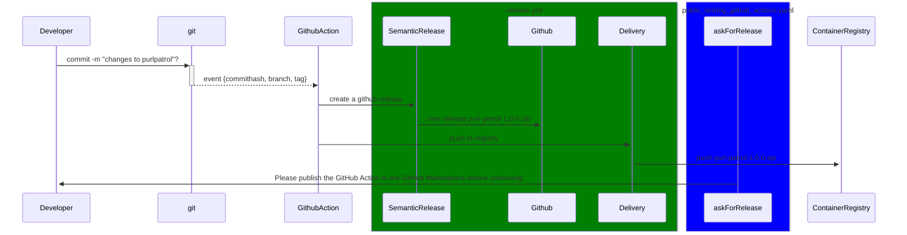

# Purl Patrol Release Process for GitHub Action

## Overview

This document outlines the release process for the PurlPatrol project.

Here is a sequence diagram that visualizes the release process:

## Release Steps
### 1. New Feature
Create a new branch for your feature. Commit all made changes to that branch. When finished merge the feature Branch to the main branch.
Or directly push the commit to the main branch.

### 2. release.yml
The push event triggers the release.yml workflow. Subsequently, the SemanticRelease job automatically generates a new GitHub release based on the commits made. Then a Docker image is built, which is then tagged with the current semantic version and the latest tag. This image is subsequently pushed to the Container Registry through the Delivery job.

### 3. public_testing_github_actions.yml
Following the release, a workflow is triggered that calls public_testing_github_actions.yml. This workflow requires approval before the testing can proceed.

The need for approval arises from the requirement to manually publish the new version of the GitHub Action from the local Dockerfile to the GitHub Marketplace. To facilitate this process, pertinent information is echoed within the required job.

Once the publication is complete, you can click "Approve" to initiate the public testing of the GitHub Action.

#### Additional Information
We opted to utilize GitHub's built-in approval step rather than rely on a separate GitHub Action for approvals. This choice enhances the workflow experience, as approvals are displayed directly within the workflow interface. In contrast, using a GitHub Action for approvals creates an issue that requires commentary and closure, which can lead to unnecessary confusion.

Additionally, we decided to incorporate an echo statement to guide the publisher regarding the approval process. This approach feels intuitive, as reviewing workflow messages is a common practice for users, making it easier for them to understand the next steps.
